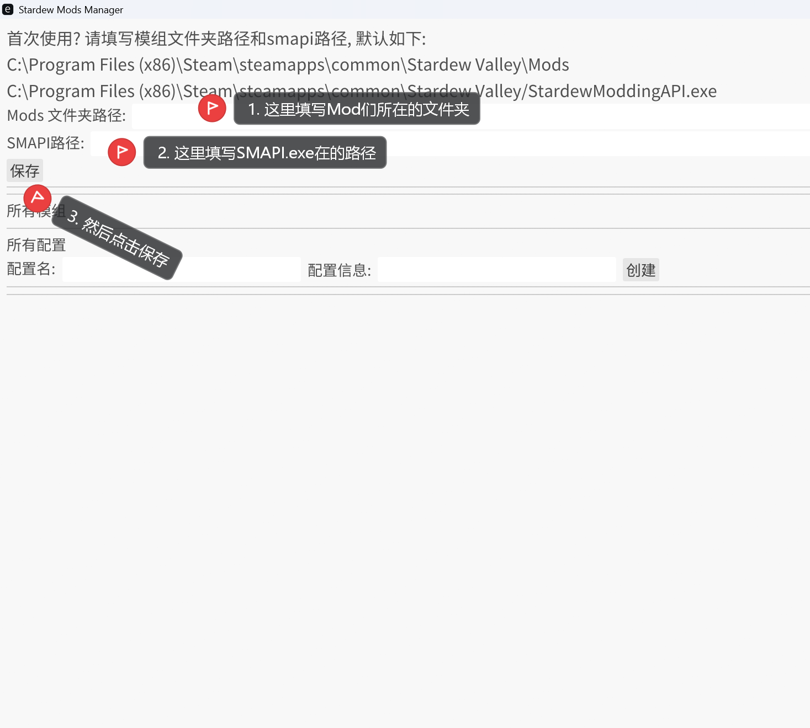
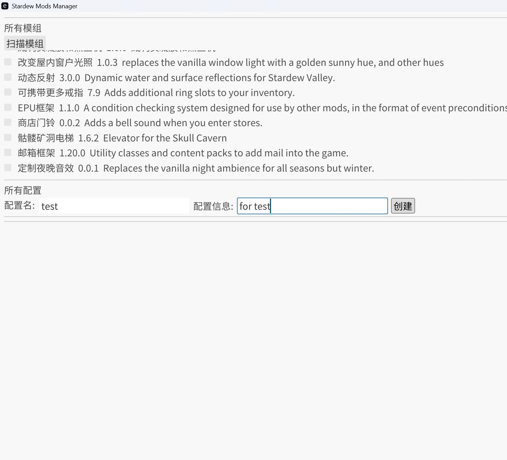
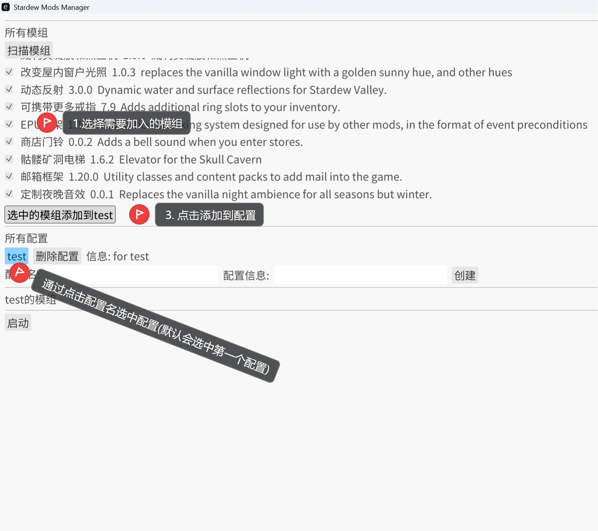
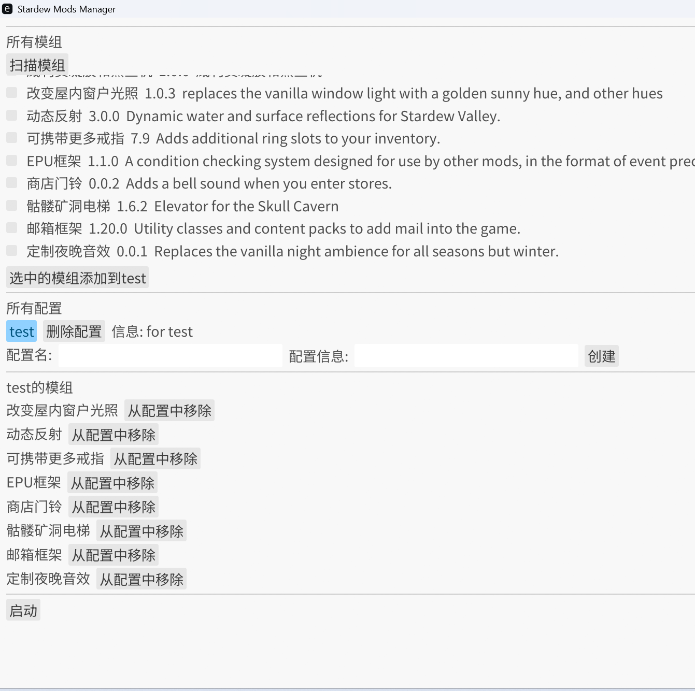

# Stardew Valley Mod Manager

这是一个用于管理《星露谷物语》模组的工具，帮助玩家轻松管理多种模组配置方案。

## 功能特性

- **模组扫描**：自动扫描星露谷模组目录，识别所有可用模组
- **配置管理**：创建、删除、编辑多个模组配置方案
- **模组关联**：将模组添加到特定配置或从配置中移除
- **快速启动**：一键启动星露谷并加载选定的模组配置

### 以例子说明

想玩 “休闲种田流”（只装季节美化、作物扩展模组），又想偶尔玩 “硬核探险流”（加战斗增强、地牢扩展模组）？

- 配置管理
  - 😭 传统方式要手动复制粘贴不同配置文件夹，还要核对模组是否漏装 / 多装；
  - 😀 管理器直接创建两个独立配置，一键切换，不用反复折腾文件，换玩法像换游戏存档一样简单。
- 高清纹理、人物美化、场景重绘模组动辄几百 MB
  - 😭 传统方式不同配置要单独复制一份，3 个配置就占 3 倍硬盘；
  - 😀 管理器只存一份模组文件。

## 系统要求

- 星露谷模组系统 (SMAPI)
- Windows 操作系统（后续拓展其他系统）
- Rust 1.70 或更高版本

## 安装与使用

使用本项目需要打开 Windows 的开发人员模式（系统>开发者选项>开发人员模式）

### 安装

#### 1. 克隆项目

```bash
git clone
cd StardewModsManager
```

#### 2. 构建项目

```bash
cargo build --release
```

#### 3. 运行应用

```bash
cargo run
```

或者直接运行编译后的可执行文件：

```bash
./target/release/StardewModsManager.exe
```

### 使用

#### step one

首次使用请填写本地的 Mods 目录路径 和 SMAPI 路径, 然后点击保存.
首次使用输入框会填写默认路径, 请核对后修改.



#### step two

填写配置名和描述, 配置名不能为空;
点击创建即可创建一个空配置.


#### step three

在模组栏寻找需要的模组, 选中.
然后选中配置,
最后点击将模组加入配置.


#### step four

点击启动, 稍等片刻, 即可游玩.


## 说明

这是一个初始项目，还存在许多问题，也许还有很多 bug 等待解决。

- 邮箱：wang_yi_gk@163.com
