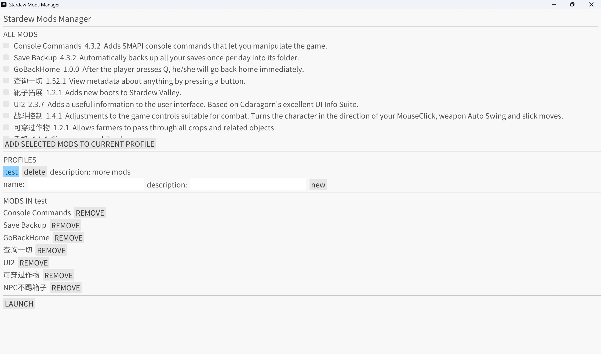

# Stardew Valley Mod Manager

这是一个用于管理《星露谷物语》模组的工具，帮助玩家轻松管理多种模组配置方案。

## 功能特性



- **模组扫描**：自动扫描星露谷模组目录，识别所有可用模组
- **配置管理**：创建、删除、编辑多个模组配置方案
- **模组关联**：将模组添加到特定配置或从配置中移除
- **快速启动**：一键启动星露谷并加载选定的模组配置

## 系统要求

- 星露谷模组系统 (SMAPI)
- Windows 操作系统（后续拓展其他系统）
- Rust 1.70 或更高版本

## 安装与使用

### 1. 克隆项目

```bash
git clone
cd StardewModsManager
```

### 2. 构建项目

```bash
cargo build --release
```

### 3. 运行应用

```bash
cargo run
```

或者直接运行编译后的可执行文件：

```bash
./target/release/StardewModsManager.exe
```

## 说明

这是一个初始项目，还存在许多问题（自定义模组路径支持不足，数据库文件存放等等），也许还有很多 bug 等待解决。

- 邮箱：wang_yi_gk@163.com
